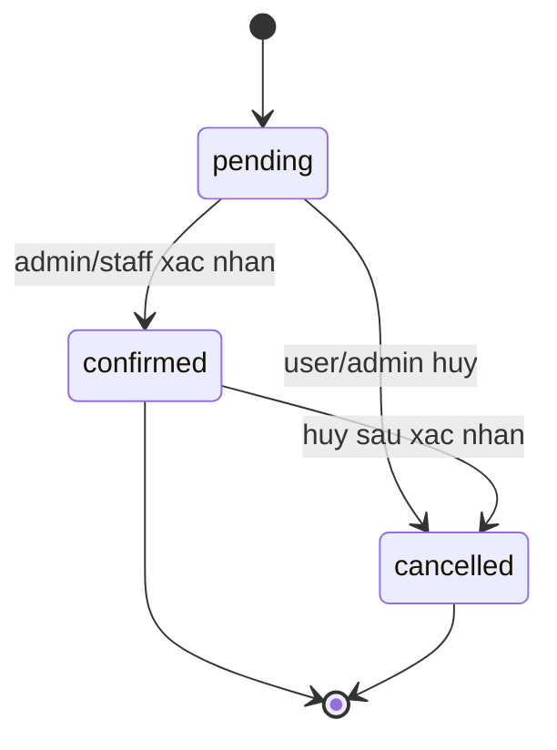
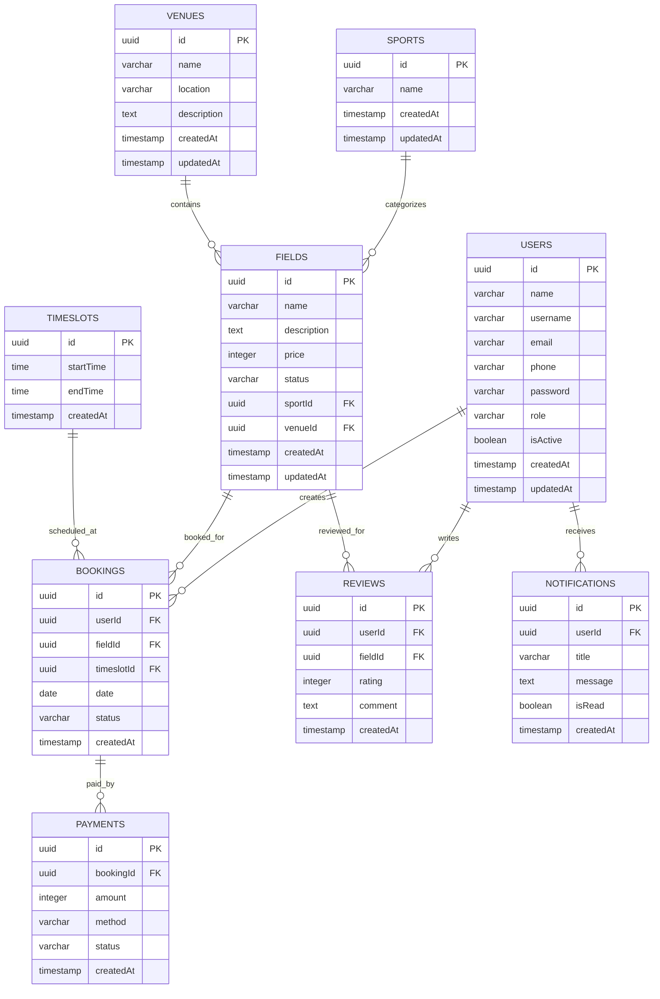

# ERP Data Design For Sports Field Booking Backend

## 1. Muc tieu he thong

Backend hien tai la nen tang dat san the thao cho web/mobile, gom cac nghiep vu:

- Quan ly tai khoan va phan quyen.
- Quan ly danh muc mon the thao.
- Quan ly dia diem/cum san.
- Quan ly san, gia, trang thai khai thac.
- Quan ly khung gio.
- Dat san, xac nhan/huy lich.
- Thanh toan theo booking.
- Danh gia san.
- Thong bao realtime cho nguoi dung.

ERP nen duoc thiet ke nhu mot dashboard van hanh noi bo cho admin/staff, dong thoi van khop truc tiep voi database va API hien co.

## 2. Module ERP de xuat

### 2.1 Identity & Access

Bang lien quan: `users`

Chuc nang:

- Quan ly nguoi dung, admin, staff.
- Khoa/mo tai khoan bang `isActive`.
- Doi thong tin ho so.
- Doi mat khau.
- Dang nhap, refresh token.

Vai tro hien co:

| Role | Y nghia | Quyen nen co |
| --- | --- | --- |
| `admin` | Quan tri he thong | Toan quyen CRUD danh muc, san, booking, payment, notification, user |
| `staff` | Nhan vien van hanh | Nen duoc xem booking/payment, cap nhat trang thai booking/payment, cham soc khach |
| `user` | Khach dat san | Dat san, thanh toan, xem thong bao, danh gia |

Luu y BE hien tai: `RolesGuard` chi cho `admin`, chua co phan quyen rieng cho `staff`.

### 2.2 Sport Catalog

Bang lien quan: `sports`

Chuc nang ERP:

- Tao/sua/xoa mon the thao.
- Dung lam danh muc phan loai san.
- Loc bao cao doanh thu/booking theo mon.

Truong du lieu:

| Field | Type | Ghi chu |
| --- | --- | --- |
| `id` | uuid | Khoa chinh |
| `name` | varchar | Ten mon, vi du: Football, Tennis |
| `createdAt` | timestamp | Ngay tao |
| `updatedAt` | timestamp | Ngay cap nhat |

### 2.3 Venue Management

Bang lien quan: `venues`

Chuc nang ERP:

- Quan ly cum san/dia diem.
- Luu ten, dia chi, mo ta.
- Lam cap cha cho `fields`.

Truong du lieu:

| Field | Type | Ghi chu |
| --- | --- | --- |
| `id` | uuid | Khoa chinh |
| `name` | varchar | Ten dia diem |
| `location` | varchar | Dia chi |
| `description` | text | Mo ta |
| `createdAt` | timestamp | Ngay tao |
| `updatedAt` | timestamp | Ngay cap nhat |

### 2.4 Field / Asset Management

Bang lien quan: `fields`

Chuc nang ERP:

- Quan ly tung san nhu mot tai san khai thac.
- Gan san vao `venue` va `sport`.
- Quan ly gia theo san qua `price`.
- Theo doi trang thai: `active`, `inactive`, `maintenance`.

Truong du lieu:

| Field | Type | Ghi chu |
| --- | --- | --- |
| `id` | uuid | Khoa chinh |
| `name` | varchar | Ten san |
| `description` | text | Mo ta san |
| `price` | integer | Gia mot khung gio theo schema hien tai |
| `status` | varchar | `active`, `inactive`, `maintenance` |
| `sportId` | uuid | FK den `sports.id` |
| `venueId` | uuid | FK den `venues.id` |
| `createdAt` | timestamp | Ngay tao |
| `updatedAt` | timestamp | Ngay cap nhat |

### 2.5 Schedule / Timeslot Management

Bang lien quan: `timeslots`

Chuc nang ERP:

- Quan ly khung gio dung chung cho cac san.
- Phuc vu tao booking va kiem tra trung lich.

Truong du lieu:

| Field | Type | Ghi chu |
| --- | --- | --- |
| `id` | uuid | Khoa chinh |
| `startTime` | time | Gio bat dau |
| `endTime` | time | Gio ket thuc |
| `createdAt` | timestamp | Ngay tao |

Khuyen nghi nghiep vu:

- Khong cho tao timeslot co `endTime <= startTime`.
- Nen tranh trung lap khung gio neu he thong dung khung gio co dinh.

### 2.6 Booking Operations

Bang lien quan: `bookings`

Chuc nang ERP:

- Xem lich dat san theo ngay, san, venue, sport.
- Tao booking ho khach.
- Xac nhan booking.
- Huy booking.
- Chan trung lich bang unique index: `fieldId + date + timeslotId`.

Trang thai hien co:

| Status | Y nghia |
| --- | --- |
| `pending` | Khach vua dat, cho xac nhan/thanh toan |
| `confirmed` | Da xac nhan giu san |
| `cancelled` | Da huy |

Truong du lieu:

| Field | Type | Ghi chu |
| --- | --- | --- |
| `id` | uuid | Khoa chinh |
| `userId` | uuid | FK den `users.id` |
| `fieldId` | uuid | FK den `fields.id` |
| `timeslotId` | uuid | FK den `timeslots.id` |
| `date` | date | Ngay dat san |
| `status` | varchar | `pending`, `confirmed`, `cancelled` |
| `createdAt` | timestamp | Ngay tao |

Luồng booking de xuat:

### 2.7 Payment / Revenue

Bang lien quan: `payments`

Chuc nang ERP:

- Ghi nhan thanh toan cho booking.
- Theo doi trang thai thanh toan.
- Bao cao doanh thu theo ngay, venue, field, sport, method.

Phuong thuc hien co:

| Method | Y nghia |
| --- | --- |
| `credit_card` | The/tich hop cong thanh toan |
| `cash` | Tien mat tai san |
| `bank_transfer` | Chuyen khoan |

Trang thai hien co:

| Status | Y nghia |
| --- | --- |
| `pending` | Cho thanh toan/xac minh |
| `completed` | Da thanh toan |
| `failed` | That bai |

Truong du lieu:

| Field | Type | Ghi chu |
| --- | --- | --- |
| `id` | uuid | Khoa chinh |
| `bookingId` | uuid | FK den `bookings.id` |
| `amount` | integer | So tien |
| `method` | varchar | `credit_card`, `cash`, `bank_transfer` |
| `status` | varchar | `pending`, `completed`, `failed` |
| `createdAt` | timestamp | Ngay tao |

### 2.8 Reviews / Customer Feedback

Bang lien quan: `reviews`

Chuc nang ERP:

- Xem danh gia theo san.
- Theo doi chat luong dich vu.
- Loc danh gia thap de xu ly.

Truong du lieu:

| Field | Type | Ghi chu |
| --- | --- | --- |
| `id` | uuid | Khoa chinh |
| `userId` | uuid | FK den `users.id` |
| `fieldId` | uuid | FK den `fields.id` |
| `rating` | integer | 1 den 5 |
| `comment` | text | Noi dung danh gia |
| `createdAt` | timestamp | Ngay tao |

### 2.9 Notification Center

Bang lien quan: `notifications`

Chuc nang ERP:

- Gui thong bao thu cong tu admin.
- Thong bao tu dong khi booking duoc xac nhan.
- Nguoi dung xem va danh dau da doc.
- Socket event hien co: `notification:new`.

Truong du lieu:

| Field | Type | Ghi chu |
| --- | --- | --- |
| `id` | uuid | Khoa chinh |
| `userId` | uuid | FK den `users.id` |
| `title` | varchar | Tieu de |
| `message` | text | Noi dung |
| `isRead` | boolean | Da doc/chua doc |
| `createdAt` | timestamp | Ngay tao |

## 3. ERD tong quan

## 4. Man hinh ERP de xuat

### Dashboard

Chi so nen hien thi:

- Tong booking hom nay.
- Booking pending can xu ly.
- Doanh thu hom nay/thang nay tu payment `completed`.
- Ti le san dang `active`, `maintenance`, `inactive`.
- Top san co doanh thu cao.
- Danh gia trung binh theo field.

### Booking Calendar

Du lieu:

- `bookings` ket hop `fields`, `venues`, `timeslots`, `users`.

Bo loc:

- Ngay.
- Venue.
- Sport.
- Field.
- Status.

Hanh dong:

- Tao booking.
- Xac nhan booking.
- Huy booking.
- Tao/cap nhat payment.

### Field Operations

Du lieu:

- `fields` ket hop `sports`, `venues`.

Hanh dong:

- Them/sua/xoa san.
- Doi trang thai san.
- Cap nhat gia.
- Loc san dang bao tri.

### Payments & Revenue

Du lieu:

- `payments` ket hop `bookings`, `users`, `fields`, `venues`.

Bao cao:

- Doanh thu theo ngay/thang.
- Doanh thu theo venue/field/sport.
- Cong no: payment `pending`.
- Thanh toan that bai: payment `failed`.

### Customer Management

Du lieu:

- `users` role `user`.
- Booking history.
- Payment history.
- Review history.
- Notifications.

### Admin / Staff Management

Du lieu:

- `users` role `admin` va `staff`.

Hanh dong:

- Tao nhan su.
- Khoa/mo tai khoan.
- Doi role.

### Feedback Management

Du lieu:

- `reviews` ket hop `users`, `fields`.

Hanh dong:

- Xem danh gia.
- Xoa danh gia vi pham.
- Loc rating 1-2 sao de cham soc.

### Notification Center

Du lieu:

- `notifications`.

Hanh dong:

- Gui thong bao cho mot user.
- Xem thong bao da doc/chua doc.
- Xoa thong bao.

## 5. API mapping hien co

| Module ERP | Endpoint BE | Quyen hien co |
| --- | --- | --- |
| Auth | `POST /auth/register`, `POST /auth/login`, `POST /auth/refresh`, `POST /auth/change-password` | Public/Auth |
| Users | `GET/PUT /users/:id`, `GET /users` | Auth |
| Users Admin | `DELETE /users/:id` | Admin |
| Sports | `GET /sports`, `GET /sports/:id` | Public |
| Sports Admin | `POST/PUT/DELETE /sports` | Admin |
| Venues | `GET /venues`, `GET /venues/:id` | Public |
| Venues Admin | `POST/PUT/DELETE /venues` | Admin |
| Fields | `GET /fields`, `GET /fields/:id` | Public |
| Fields Admin | `POST/PUT/DELETE /fields` | Admin |
| Timeslots | `GET /timeslots`, `GET /timeslots/:id` | Public |
| Timeslots Admin | `POST/PUT/DELETE /timeslots` | Admin |
| Bookings | `GET /bookings` | Admin |
| Booking detail/create/update/delete | `GET/POST/PUT/DELETE /bookings` | Auth |
| Payments | `GET /payments` | Admin |
| Payment detail/create | `GET/POST /payments` | Auth |
| Payment update/delete | `PUT/DELETE /payments` | Admin |
| Reviews | `GET /reviews`, `GET /reviews/:id` | Public |
| Reviews create/update | `POST/PUT /reviews` | Auth |
| Reviews delete | `DELETE /reviews/:id` | Admin |
| Notifications Admin | `GET/POST/PUT/DELETE /notifications` | Admin |
| Notifications User | `GET /notifications/me`, `GET /notifications/user/:userId`, `PATCH /notifications/:id/read` | Auth |

## 6. Quy tac nghiep vu can giu dong bo voi BE

- Mot san khong duoc co hai booking trung `fieldId + date + timeslotId`.
- Khi booking chuyen sang `confirmed`, BE tao notification "Booking confirmed".
- Payment nen gan voi booking da ton tai.
- Review rating chi hop le tu 1 den 5.
- Field chi nen cho dat khi `status = active`.
- User bi `isActive = false` nen bi chan dang nhap/dat san, hien BE chua enforce dieu nay.

## 7. De xuat mo rong schema cho ERP day du hon

Backend hien tai du cho MVP. Neu muon ERP ro hon, nen bo sung cac cot/bang sau:

### 7.1 Field ownership and staffing

Them vao `venues`:

| Field | Ly do |
| --- | --- |
| `ownerId` | Gan venue cho chu san/admin/staff quan ly |
| `phone` | Lien he dia diem |
| `openingTime`, `closingTime` | Gio hoat dong |

Bang moi `venue_staffs`:

| Field | Ly do |
| --- | --- |
| `venueId` | Venue duoc phan cong |
| `userId` | Staff phu trach |
| `role` | Quan ly, thu ngan, van hanh |

### 7.2 Flexible pricing

Bang moi `field_prices`:

| Field | Ly do |
| --- | --- |
| `fieldId` | San ap dung |
| `timeslotId` | Khung gio ap dung |
| `dayOfWeek` | Gia theo thu |
| `price` | Gia rieng |
| `effectiveFrom`, `effectiveTo` | Thoi gian hieu luc |

Ly do: `fields.price` chi du cho mot gia co dinh, chua du cho gio cao diem/cuoi tuan.

### 7.3 Booking audit trail

Bang moi `booking_logs`:

| Field | Ly do |
| --- | --- |
| `bookingId` | Booking bi thay doi |
| `actorId` | Ai thuc hien |
| `fromStatus`, `toStatus` | Doi trang thai |
| `note` | Ly do |
| `createdAt` | Thoi diem |

Ly do: ERP can truy vet khi staff/admin xac nhan hoac huy booking.

### 7.4 Payment reconciliation

Them vao `payments`:

| Field | Ly do |
| --- | --- |
| `transactionCode` | Ma giao dich ngan hang/cong thanh toan |
| `paidAt` | Thoi diem thanh toan thanh cong |
| `confirmedBy` | Staff/admin xac nhan thu tien |
| `note` | Ghi chu doi soat |

### 7.5 Soft delete and timestamps

Nen them:

- `updatedAt` cho `bookings`, `payments`, `reviews`, `notifications`, `timeslots`.
- `deletedAt` cho cac bang quan trong de ERP khong mat lich su khi xoa.

## 8. Thu tu uu tien trien khai ERP frontend

1. Auth + layout dashboard theo role.
2. CRUD danh muc: sports, venues, timeslots.
3. Field management.
4. Booking calendar + conflict handling.
5. Payment management + revenue dashboard.
6. Customer/review/notification management.
7. Audit trail va bao cao nang cao sau khi mo rong schema.

